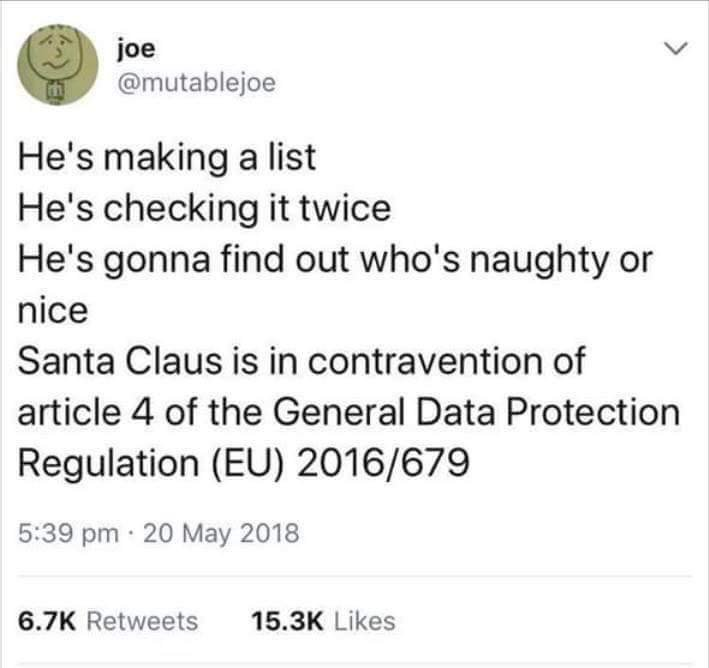

# Ledarhelg

## GDPR och lite annat...

---

{}

# Ämnen

{}GDPR{}

{}Scoutnet{}

{}Höjdarscout.se{}

{}

---

# GDPR

---

{}

# Översikt

### Vad är dataskyddsförordningen?

---

### I korthet

- Stärkt skydd av behandling av personuppgifter
- Gemensamt för EU
- Trädde i kraft 25 maj 2018
- Gäller oavsett format

---

---

### Personuppgift

_”Varje upplysning som avser en identifierad eller identifierbar fysisk person.”_

{}Exempel:{}

{}Namn{}
{}, Adress{}
{}, Telefonnummer{}

{}Mejladress{}
{}, Medlemsnummer{}
{}, Foto{}

{}Personnummer{}
{}, Hälsa{}
{}, m.m.{}

---

- _Information (digital eller fysisk) som kan kopplas till en människas privata, publika eller yrkesmässiga identitet_

- _Flera olika typer av uppgifter kan identifiera en person_

- _En grupp färre än 7 personer = identifierbart_

<!-- {}
{} -->

---

### Känslig personuppgift

Uppgifter om

- Religion
- Politisk uppfattning
- Hälsa (allergier, sjukdomar och dyl.)
- _Personnummer_
- _Lagöverträdelse_
- och några till...

Får **inte** behandlas (med några undantag)

---

### Grundregel

Behandla inget!

**Om** det inte finns laglig grund:

- Avtal
- Samtycke
- Berättigat intresse
- _Rättslig förpliktelse_
- _Myndighetsutövning_
- _Allmänt intresse_

{}Men: Annan lagstiftning "vinner" över GDPR.{}

---

### Vad är _behandling_?

- Inhämtning
  - Insamling, Registrering, Framtagning
- Lagring
- Hantering
  - Ändring, Läsning, Användning, Strukturering, Organisering, ...
- Delning
  - Överföring, Spridning, Tillhandahållande
- Gallring
  - Lagring, Radering, Förstöring

---

### Rättigheter för den registerade

- Rätten till _information_
- Rätten till _registerutdrag_
- Rätten till _rättelse_
- Rätten till _radering_
- Rätten till _begränsning av behandling_
- Rätten till _dataportabilitet_
- Rätten till _invändning_

---

### Grundläggande principer för integritetsskydd

- _inte samla in_ mer information än vad som behövs
- _inte lämna ut_ den till fler än de som behöver se den
- _inte ha kvar_ informationen längre än nödvändigt
- _inte_ använda uppgifterna _till något annat_ än vad som var syftet när de samlades in

<!--

### Personuppgiftsincidenter

-->
<!--
- _Oavsiktlig_ eller _olaglig_ förstöring, förlust eller ändring av personuppgifter
- _Obehörigt_ röjande av eller obehörig åtkomst till personuppgifterna

- Ska _anmälas_ till Datainspektionen inte senare än _72 timmar_ efter det att man har fått vetskapen
- I vissa fall ska den _registrerade_ som berörs av incidenten _informeras_

- Ska _dokumenteras_ av personuppgiftsbehörige

### Steg för att hantera personuppgifter

1. Ändamål för behandling?
2. Laglig grund?
3. Nödvändigt?
4. Korrekt och öppet
5. Adekvata, relevanta och inte för omfattande

 -->

{}

---

{}

# I kåren

---

### När behandlar vi personuppgifter?

Förslag?

{}
Förslag?
{}

---

### När behandlar vi personuppgifter?

- Nyanmälning
- Närvaro
- Anmälan till aktiviteter
- Utskick
- ...

<!-- ---

### Nya scouter

{}Förälder{}
{}-> nyanmälningsansvarig{}
{}-> ledare{}
{}-> förälder{}
{}-> medlemsregisterare{}

---

### Närvaro

- Namn
- Födelsedatum
- Postnummer -->

---

### Övernattning

- Anmälan och hälsokort - känsliga personuppgifter!
- Hantera med försiktighet.

- Förstör hälsokort efteråt
- Ta in så lite data som möjligt, men tillräckligt för att genomföra aktiviteten.

---

### Vad får vi samla in?

Så lite som möjligt - bara det vi måste!

{}

---

{}

# Överföring

---

### Vad får vi föra över mellan avdelningarna?

- Namn, personnummer och adress får skickas till mottagande avdelning och medlemsregistreraren.
- Hälsouppgifter får **INTE** skickas vidare.
  - Enklare att hålla aktuella

---

# Fall

{}Ledare skickar "_Pelle_ är sjuk och kommer inte på kvällens möte" på Facebook Messenger (eller annan chatt){}

{}Närvarokort som ligger framme{}

{}"Bra att ha"-uppgifter, vad sparar vi och hur länge?{}

{}Ha en egen lista med uppgifter till scouterna på avdelningen?{}

{}Hälsokort från övernattning/hajk/läger?{}

{}

---

{}

## Sammanfattning

- Hantera inte mer personuppgifter än nödvändigt
- Hälsokort är känslig personuppgift, med högre krav.
- GDPR gäller även lösa papper.

{}

---

{}

# höjdarscout.se

---



---

## Frågor:

{}Hur ofta är ni inne?{}

{}Syfte med hemsidan?{}

{}Innehåll?{}

---



---



---

- Inloggning kopplad till Scoutnet (ScoutID)
- Uppdaterad säkerhet (HTTPS)

---

# Slutligen

Undersöker (_inga beslut tagna_):

- Förbättrade mejllistor
- Google Teamdrive på avdelning/gren/kårnivå
- Kårmejl (?)

{}

---

{}

# Scoutnet

---

## Vad är Scoutnet?

{}Medlemsregister för riksorganisationen Scouterna{}

---

## Funktioner

_Beroende på behörighet:_

- {}Ändra sina egna uppgifter{}

- {}Hantera scouter på avdelningen{}

- {}Mejllistor inom kåren{}

- {}Statsbidragsansökan{}

- {}Rapporter{}

- {}Aktiviteter (anmälan, skapa){}

---



---

## Varför Scoutnet?

- GDPR-säkrat!

- Uppgifterna finns redan där

- Alla medlemmar har konto

---

## Begränsningar

{}
Dubblerande scouter kan inte hanteras av AL (annan avdelning).

Otydligt med mejllistor
{}

- Dubblerande scouter
  - Hantera
  - Mejllistor
- Aktiviteter
  - Skapa aktiviteter är krångligt

{}_Högre prioritet för utveckling efter DJ2018_{}

---

## På gång

- Uppdaterad manual, senast Scoutforum (13-15 / 9 2019)
- Inloggning för vårdnadshavare
- Färdiga mallar för aktiviteter (vårvintern)
- Hälsoinformationsmodul (idé, inte klart)
- ScoutID

{}