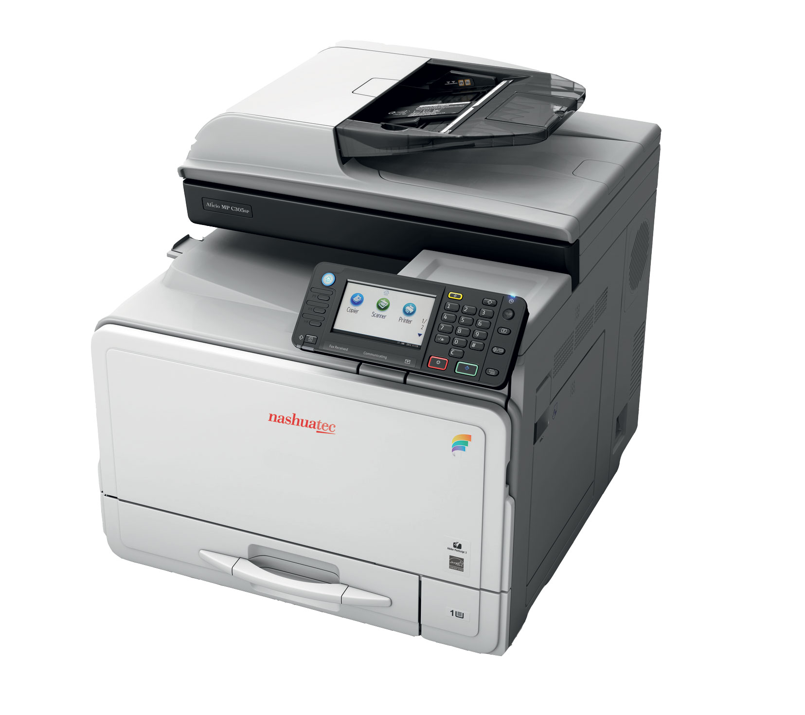
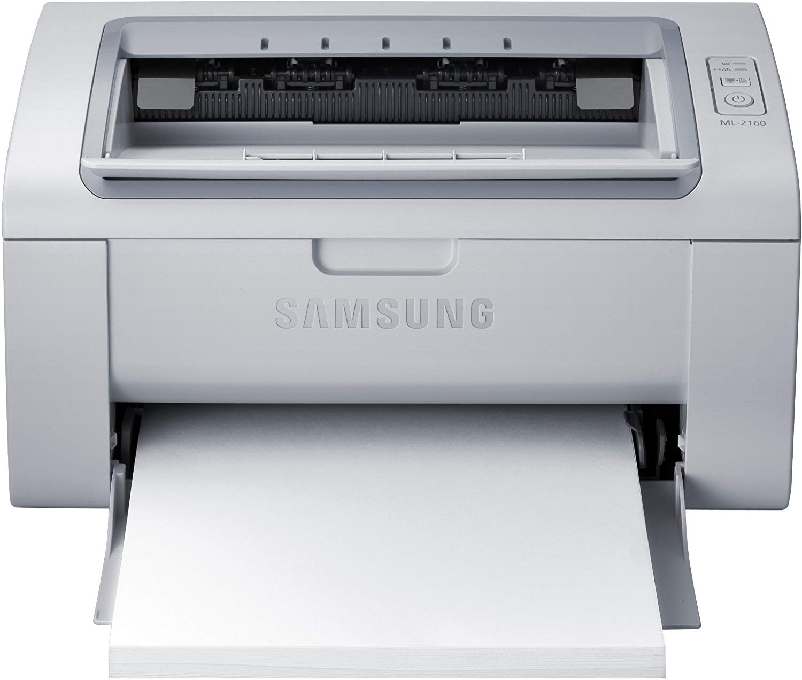

{}
Presentera mig.
{}

# IT

Lite blandat om teknik

---

{}
Översikt av presentationen.
Blandade punkter - många men några är korta.
{}

## Innehåll

- Nätverket i Kåken
- Projektorer
- Skrivare
- Scoutnet
- Hemsida
- Kårmejl- och kårdrive

---

{}
Berätta kort om nätverket.

Har varit igång ungefär ett år.

Det finns, kan vi göra något kul med det?

Behäver något ändras?
{}

## Nätverk och internet

- Trådat nätverk i större delen av Kåken

- Trådlöst nätverk i (nästan) hela Kåken

- Säg till om något krånglar eller saknas
    - it@hojdarscout.se

---

{}
Kort om projektorerna vi har.
{}

## Projektorer

Två stycken
- Lampa
- LED

---

{}

## Kopiator och skrivare

{}
Jag visste inte, så tänker att fler inte har koll.

Vilka skrivare har vi, vem sköter underhåll, vad ingår.

Enklare om alla vet vad som gäller.
{}

* Vilka har vi?

* Vem sköter underhåll?

* Vad ingår?

---

### Kopiator

{}
Nytt med USB-minnen.
{}

- Färg
- Skriv ut från
    - Dator (med USB-kabel)
    - USB-minne (finns på kontoret)  
- Avtal på kopiatorn
    - Kvot per månad
        - Fler sidor S/V än färg
    - Skrivarpapper ingår ej
---

### Portabel skrivare

- Svart/vit
- Skriv ut från
    - Dator (med kabel)
    - Trådlöst
        - Inloggning står på  
- Underhålls helt av kåren

---

### Varför?

Vill att fler vet hur det fungerar

{}

---

{}

{}
Varför ska du kunna inloggningsuppgifter, hur loggar du in, hur håller vi informationen uppdaterad?
{}

## Scoutnet

* Vad är det
* Inloggning
* Ledarens uppgifter
* Uppdateringar
* ScoutID

---

### Vad?

{}
Nyanmälan är nytt.

Kommer jobba bort specialfall från e-postalias...
{}

Medlemsregister för riksorganisationen Scouterna.
- Används för bland annat:
    - Utskick
    - E-postlistor + alias
    - Anmälan till arrangemang/aktiviteter
    - Statsbidragsansökan
    - Rapporter
    - Nyanmälan
- Används EJ för:
    - Hälsouppgifter

---

### Inloggning

{}
Inloggning med personnummer är nytt.
Primär e-postadress är viktig!
{}

- Vem kan logga in?
    - Alla registrerade medlemmar
- Hur loggar du in?
    - Medlemsnummer (står på fakturan)
    - Primär e-postadress i Scoutnet
    - Personnummer (YYYYMMDD-NNNN)
- Var hittar du ditt lösenord?
    - Tryck "glömt lösenord"
    - Skickas till primär e-postadress

---

### Ledarens uppgifter

- Ledarens uppgift
    - Stämmer medlemmar på avdelningen?
    - Hålla patrull, PL, vPL uppdaterat
    - Vilka är ledare/funktionär på avdelningen?
    - Statsbidragsansökan

- Manual: [scoutnet.scout.se](https://scoutnet.scout.se)

---

### Uppdatering

{}
399 medlemmar, hur håller vi adresser och uppgifter uppdaterat?

Ringa runt?

Diskutera!
{}

- Hur håller vi uppgifterna uppdaterade?

- Vem sköter uppdateringen?
    - Medlemsregistrerare
    - Ledare (AL)
    - Medlem

---

{}
Bra att hålla koll på.
{}

En inloggning till flera scout-tjänster!

{}

---

{}
Information om hemsidan.
{}

## Hemsidan

Nya [hemsidan](https://hojdar.scout.se) är lanserad
- Vad står det om din avdelning?
    - Terminsprogram?
    - Ledare?
- Hur håller vi hemsidan uppdaterad?
    - AL får åtkomst 
        
        - [https://hojdar.scout.se/wp-admin](https://hojdar.scout.se/wp-admin)
    - Manual: [webbsupport.nykarwebb.se](https://webbsupport.nykarwebb.se/)

---

{}
Begränsad åtkomst istället för lösenord på hemsidan.
{}

## Kårmejl och kårdrive

- Alla LURK har en @hojdarscout.se-adress.
    - **L**edare, **U**tmanare, **R**over, **K**årfunktionärer
- Google-konto
    - [mail.google.com/a/hojdarscout.se](https://mail.google.com/a/hojdarscout.se)
    - Finns stöd för grupper, Google Drive m.m.
        - Kårpraxis, mallar, ...
- Inloggning via  

---

## Avslutande fråga

Nätverk | Projektorer | Skrivare | Scoutnet | Hemsida | Kårmejl/drive

Hur kan vi använda det här?

_Förslag:_

{}_Dela material_{}

{}_Aktivitetsbank_{}

{}_Kårens historia_{}

it@hojdarscout.se